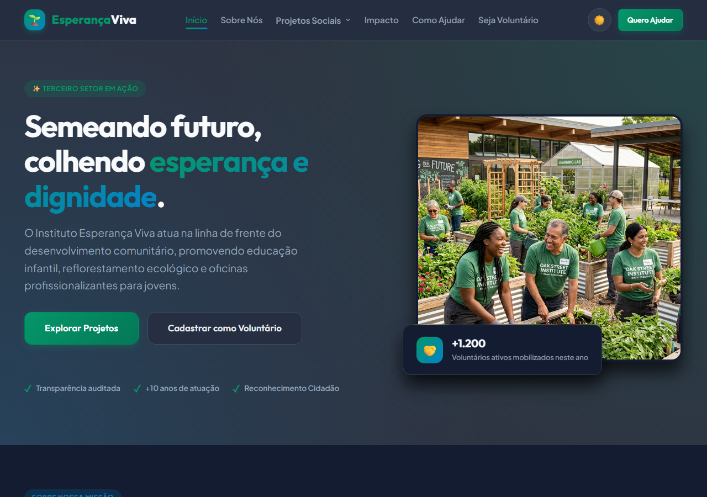
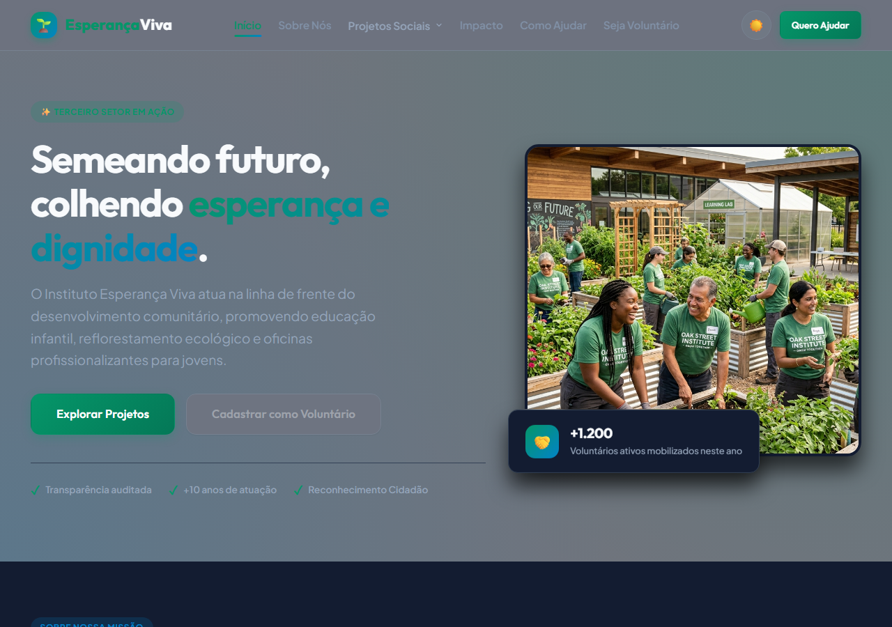
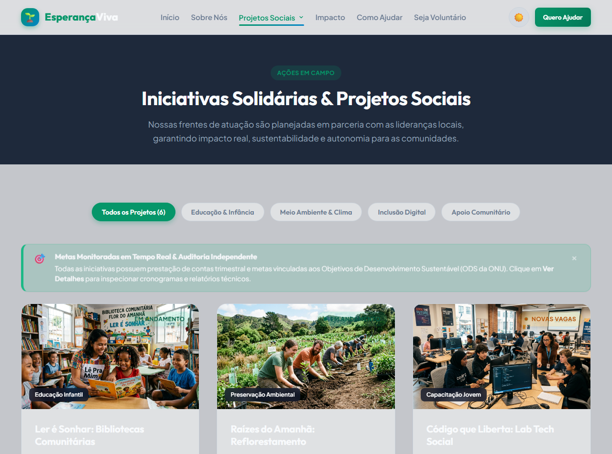
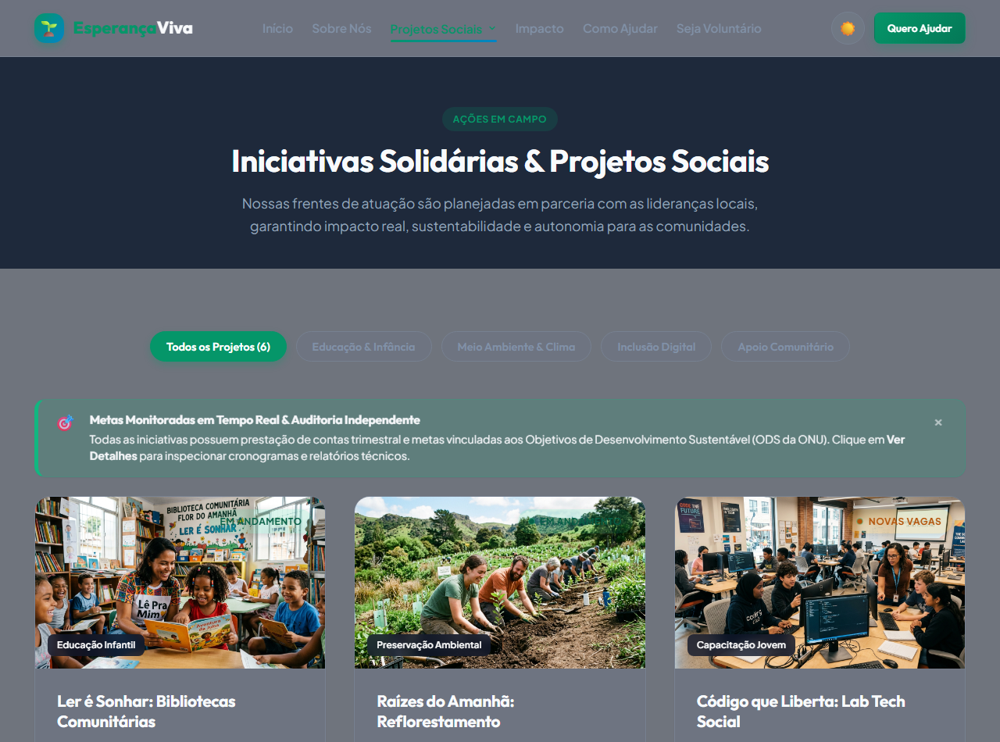
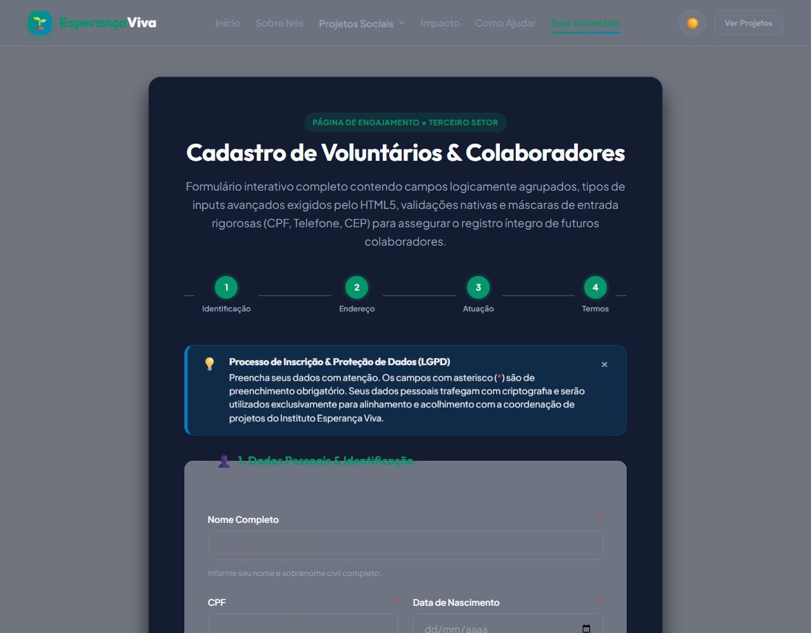
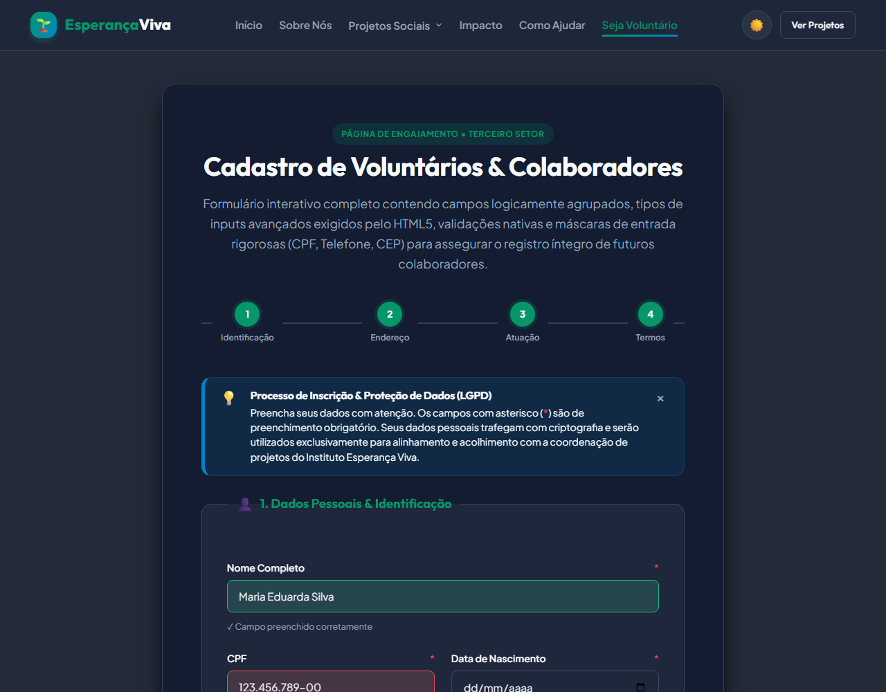
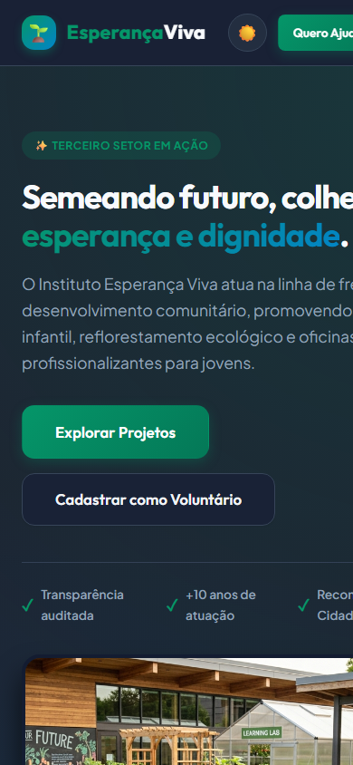
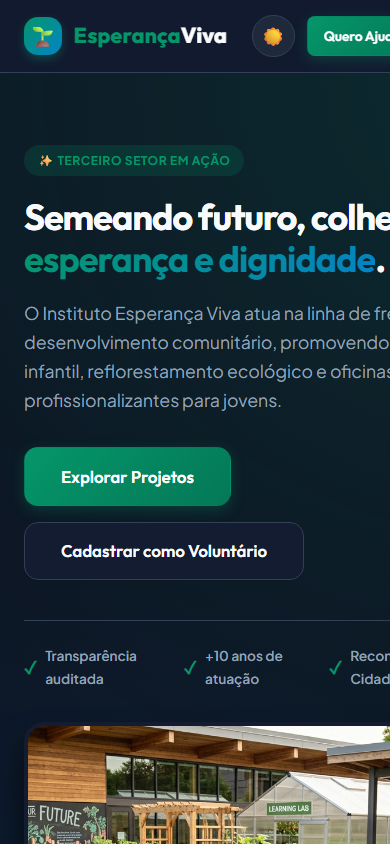

# 🌿 Instituto Esperança Viva | Plataforma Front-end para ONG

[](LICENSE)
[](https://developer.mozilla.org/pt-BR/docs/Web/HTML)
[](https://developer.mozilla.org/pt-BR/docs/Web/CSS)
[](https://developer.mozilla.org/pt-BR/docs/Web/JavaScript)
[](https://pages.github.com/)

> **Projeto acadêmico de desenvolvimento front-end estruturado e validado para o Terceiro Setor.**  
> Uma plataforma web moderna, acessível e de alto impacto visual para o **Instituto Esperança Viva**, organização socioambiental dedicada à educação comunitária, reflorestamento ecológico e capacitação profissional de jovens.

---

## 📖 Contexto

> As organizações do terceiro setor frequentemente lidam com recursos limitados e dependem enormemente do engajamento de voluntários e da captação de doações. A falta de uma plataforma digital clara, acessível e bem estruturada pode comprometer severamente a credibilidade institucional e dificultar a navegação dos apoiadores. O uso apropriado da semântica na linguagem HTML5 não é apenas uma boa prática de programação, mas um requisito essencial para garantir a correta indexação nos motores de busca (SEO) e fornecer um nível adequado de acessibilidade digital para todos os usuários.

---

## 🚩 Desafio

> Projetar e desenvolver um conjunto de páginas *web* utilizando o padrão HTML5 semântico, assegurando uma arquitetura de informação coerente e organizada em diretórios estruturados: uma página inicial (`index.html`) apresentando a ONG, uma página sobre iniciativas solidárias (`projetos.html`) e uma página de engajamento (`cadastro.html`). O grande destaque do desafio será implementar, nesta última, um formulário interativo completo contendo validações nativas e máscaras de entrada rigorosas (CPF, Telefone, CEP) para assegurar o registro íntegro de futuros colaboradores.

---

## 🎯 Atendimento Rigoroso ao Desafio (Etapas Práticas)

O projeto foi rigorosamente estruturado atendendo aos requisitos técnicos do itinerário prático:

### 1. Início da Experiência Prática
* **Recepção e Contextualização**: Definição da identidade do **Instituto Esperança Viva**, missão institucional, valores de sustentabilidade e responsabilidade cidadã.
* **Design System & Acessibilidade**:
  * Paleta de cores inspirada na natureza e na esperança (verde esmeralda `#059669`, azul petróleo `#0284c7`, toques âmbar e neutros refinados).
  * Tipografia moderna via Google Fonts: **Outfit** (títulos marcantes) e **Plus Jakarta Sans** (leitura fluida e acessível).
  * **Alternador de Tema (Dark / Light Mode)** nativo em CSS Variables e persistido no `localStorage`.
  * Fotografias reais em alta definição para o Hero e projetos sociais, sem uso de placeholders genéricos.

### 2. Estrutura Semântica e Páginas
* **`index.html` (Página Inicial Institucional)**:
  * Hierarquia semântica completa: `<header>`, `<nav>`, `<main>`, `<section>`, `<article>` e `<footer>`.
  * **Hero Section** imersivo com selos de transparência e botões de ação rápida.
  * **Contadores de Impacto Animados** acionados ao rolar a página (*Intersection Observer*): +14.850 vidas impactadas, +48 comunidades, +32.400 mudas plantadas e +1.280 voluntários.
  * **Simulador Interativo de Doação PIX**: Valores rápidos (R$ 20, R$ 50, R$ 100, R$ 200) com impacto calculado e cópia instantânea da chave.
* **`projetos.html` (Galeria de Projetos Sociais)**:
  * Sistema de filtros por categoria em tempo real (*Todos*, *Educação & Infância*, *Meio Ambiente*, *Inclusão Digital* e *Apoio Comunitário*).
  * Cards semânticos estruturados com tags, status da iniciativa (*Em Andamento*, *Inscrições Abertas*), metas visuais com barra de progresso em porcentagem e botão para se voluntariar.

### 3. Formulários Interativos e Cadastro Avançado
* **`cadastro.html` (Ficha Oficial de Adesão ao Voluntariado)**:
  * **Agrupamento Lógico Semântico**: Estruturação obrigatória utilizando `<fieldset>` e `<legend>`:
    * **1. Dados Pessoais & Identificação**: Nome completo, CPF, Data de Nascimento, E-mail, Celular/WhatsApp e Área de Ocupação.
    * **2. Endereço Residencial**: CEP, Logradouro, Número, Complemento, Bairro, Cidade e UF.
    * **3. Perfil de Atuação & Disponibilidade**: Seleção interativa de áreas de interesse, dedicação semanal estimada em horas, turnos de atuação, envio de currículo e descrição de competências.
    * **4. Termos e Compromisso Social**: Declaração de adesão voluntária conforme a **Lei Federal nº 9.608/1998** e consentimento da **LGPD (Lei nº 13.709/2018)**.
  * **Tipos de Inputs Avançados do HTML5**:
    * `type="text"` com atributos `autocomplete="name"`, `minlength`, `maxlength` e `spellcheck="false"`.
    * `type="email"` com validação nativa de formato e `pattern="[a-z0-9._%+-]+@[a-z0-9.-]+\.[a-z]{2,}$"`.
    * `type="date"` com limites de consistência (`min="1920-01-01"` e `max="2010-12-31"`).
    * `type="tel"` com `inputmode="tel"` e `pattern="\([0-9]{2}\)\s[0-9]{4,5}-[0-9]{4}"`.
    * `type="number"` para número residencial com `min="1"` e `max="999999"`.
    * `<datalist id="listaProfissoes">` integrado com `input list="listaProfissoes"` para autocompletar áreas de formação e competências.
    * `type="range"` com elemento semântico `<output>` interativo em tempo real para cálculo de disponibilidade semanal de horas (2 a 40 horas/semana).
    * `type="file"` estilizado para anexar currículo ou carta de apresentação nos formatos `.pdf`, `.doc` e `.docx` com feedback visual do arquivo selecionado.
  * **Máscaras de Entrada em Vanilla JS**: Formatação dinâmica e inteligente para CPF (`000.000.000-00`), CEP (`00000-000`) e Celular (`(00) 00000-0000`).
  * **Validação Algorítmica de CPF**: Cálculo dos dígitos verificadores matemáticos oficiais, rejeitando números inválidos e dígitos repetidos.
  * **Preenchimento Automático via API ViaCEP**: Busca assíncrona ao digitar o CEP, autopreenchendo rua, bairro, cidade e estado, focando automaticamente no campo número.
  * **Conformidade Técnica W3C & Acessibilidade**:
    * Código 100% validado conforme as diretrizes do **W3C HTML5 Validator**.
    * Associação estrita de todos os campos com `<label for="...">`, tags semânticas, `aria-required`, `aria-describedby` para leitores de tela e robôs de busca.
    * Feedback visual e sonoro com bordas verdes/vermelhas, mensagens com `aria-live` e notificações **Toast** animadas ao submeter.

---

## 📂 Arquitetura de Pastas e Arquivos

```text
Faculdade Projetos/ONG/
├── index.html              # Página Inicial institucional (Etapas 1 e 2)
├── projetos.html           # Página de Projetos Sociais com filtros (Etapa 2)
├── cadastro.html           # Formulário Avançado de Cadastro (Etapa 3)
├── README.md               # Documentação técnica e guia do repositório
├── .gitignore              # Filtro de arquivos de sistema e logs
├── css/
│   ├── style.css           # Design System global, variáveis, header, footer e toasts
│   ├── pages.css           # Estilos de seções (Hero, Métricas, Cards, Fieldsets)
│   └── responsive.css      # Responsividade e menu gaveta mobile
├── js/
│   ├── main.js             # Modo escuro/claro, menu mobile, contadores e toasts
│   ├── masks.js            # Máscaras de CPF, CEP e Telefone em JavaScript puro
│   ├── validation.js       # Validação de CPF, integração com ViaCEP e formulário
│   └── projects.js         # Filtros por categoria e simulador de doações PIX
└── assets/
    └── images/             # Fotografias em alta resolução das ações sociais
        ├── hero.jpg
        ├── project-educacao.jpg
        ├── project-meio-ambiente.jpg
        └── project-tecnologia.jpg
```

---

## 🎨 Design System e Estruturação CSS3 Avançada

O projeto utiliza o estado da arte do **CSS3 puro (Vanilla CSS)**, combinando técnicas de engenharia de software com design visual moderno:

### 1. Sistema de Design Tokens Consistente
* **Paleta Semântica**: Tokens primários (`--primary`, `--primary-light`, `--primary-dark`), secundários (`--secondary`), de destaque (`--accent`) e neutros equilibrados para os modos claro e escuro.
* **Escala de Espaçamento Modular**: De `--space-1` (4px) até `--space-20` (80px), garantindo ritmo vertical e horizontal harmônico.
* **Escala de Elevação & Z-Index**: 5 níveis de sombras com luz ambiente (`--shadow-sm` a `--shadow-xl`) e gerenciamento hierárquico estrito de camadas (`--z-dropdown`, `--z-sticky`, `--z-drawer`, `--z-backdrop`, `--z-modal`, `--z-toast`).
* **Tipografia Fluida**: Uso de funções CSS nativas `clamp()` para escalonamento automático de fontes de acordo com a largura da tela sem quebras abruptas.

### 2. Layouts Responsivos com CSS Grid e Flexbox
* **Grandes Blocos em CSS Grid**:
  * Hero Section em split-grid assimétrico (`1.15fr 0.85fr`).
  * Grade de métricas de impacto em 4 colunas com adaptação automática para 2 colunas e 1 coluna em telas menores.
  * Galeria de projetos sociais estruturada em grade de 3 colunas (`grid-template-columns: repeat(3, 1fr)`).
  * Formulário avançado com subgrades independentes para CEP/Número e Cidade/UF.
* **Componentes Internos com Flexbox**:
  * Navbar e cabeçalho alinhados com `justify-content: space-between` e `align-items: center`.
  * Cards de projetos com estrutura flexbox vertical (`flex-direction: column`) para manter o rodapé alinhado independentemente do tamanho do texto descritivo.
  * Indicadores de progresso e botões de ação com alinhamento dinâmico.

### 3. Navegação Interativa Desktop & Mobile
* **Desktop**: Header translúcido com efeito *glassmorphism* (`backdrop-filter: blur(14px)`), indicador animado de link ativo no rodapé de cada item.
* **Mobile Drawer**: Menu lateral deslizante com curva `cubic-bezier(0.16, 1, 0.3, 1)`, fundo escurecido com *backdrop blur* e **botão hamburger morfológico** que se transforma suavemente em um "X" através de rotações e translações CSS3 em 3 barras vetoriais.

### 4. Cartões, Modais e Componentes Auxiliares
* **Cartões Dinâmicos**: Elevação em hover (`translateY(-6px)`), zoom suave na fotografia e **efeito shimmer** animado na barra de progresso (`@keyframes shimmerProgress`).
* **Pílulas de Status**: Indicador visual com ponto pulsante contínuo (`@keyframes pulseDot`) para projetos em andamento e novas vagas.
* **Modais Acessíveis**: Dossiê detalhado dos projetos sociais e Simulador de QR Code PIX com backdrop blur, animação de entrada com escala, fechamento por clique externo ou tecla `Escape` e foco acessível.
* **Feedbacks de Formulário**: Anel de foco luminoso, validações visuais com ícones de sucesso/erro e cards de área de atuação com marcação em pop-check ao serem selecionados.

### 5. Acessibilidade Digital (WCAG AAA)
* **Alto Contraste no Foco**: Estilização estrita de `:focus-visible` com anel de 3px e deslocamento (`outline-offset: 3px`).
* **Redução de Movimento**: Suporte nativo à diretiva `@media (prefers-reduced-motion: reduce)` que desativa animações para usuários sensíveis.
* **Touch Targets Otimizados**: Todos os botões e links de toque possuem dimensões mínimas de 44x44px.
* **Estilo de Impressão**: Folha de estilos dedicada `@media print` otimizando a página para impressão limpa de relatórios da ONG.

---

## 🔬 Engenharia de Interatividade, Microinterações e Estados no CSS3

> *"Os estados interativos são a forma de o software dialogar com o utilizador final sem demandar leituras extensas."*

A arquitetura CSS3 da plataforma do **Instituto Esperança Viva** foi concebida sob rigorosos padrões de usabilidade, ergonomia cognitiva e design instrucional. Cada componente visual comunica seu propósito e estado operacional através de microinterações determinísticas, prevenindo erros do usuário e acelerando as conversões digitais (doações e inscrições de voluntários).

### 1. Estados Interativos Convencionais em Botões (`.btn`)
Os botões representam os principais pontos de conversão da interface. Para garantir que o usuário perceba instantaneamente a resposta às suas ações motoras, foram implementadas as 4 mutações visuais fundamentais:
* **`:hover` (Sobreposição)**: Quando o cursor repousa sobre o botão, uma transição de 0.25s aplica elevação mecânica sutil (`transform: translateY(-2px)`) combinada com aprofundamento da sombra de projeção (`box-shadow: 0 6px 20px rgba(...)`) e realce do gradiente cromático. Isso comunica inequivocamente a clicabilidade do elemento.
* **`:focus` e `:focus-visible` (Foco Assistivo & Teclado)**: Seguindo os critérios W3C WCAG 2.1 (Critério 2.4.7), o foco por teclado gera um anel de destaque externo com `outline: 3px solid var(--primary)` e afastamento `outline-offset: 3px`, além de halo luminoso suave (`box-shadow: 0 0 0 4px var(--primary-light)`). Essa separação garante que usuários navegando via tecla `Tab` nunca percam a referência espacial de navegação, ao mesmo tempo em que previne anéis invasivos em cliques normais com o mouse.
* **`:active` (Compressão / Clique)**: Ao pressionar o botão, ocorre uma micro-resposta háptica virtual: o elemento sofre leve deslocamento descendente (`transform: translateY(1px) scale(0.98)`) e a sombra é encurtada (`box-shadow: 0 2px 6px rgba(0, 0, 0, 0.2)`). Essa física mecânica simula a depressão física de uma tecla, confirmando ao cérebro do usuário que o gatilho da ação foi ativado com sucesso.
* **`:disabled` / `[disabled]` / `.disabled` (Inoperância Semântica)**: Quando uma ação está indisponível (como envio pendente de termos legais ou processamento em curso), o elemento é desativado visualmente com atenuação de opacidade (`opacity: 0.55`), dessaturação cromática parcial (`filter: grayscale(45%)`), remoção total de elevações e cursor indicativo de bloqueio (`cursor: not-allowed !important; pointer-events: none;`).

```css
/* Código-fonte representativo em style.css */
.btn {
  transition: all 0.25s cubic-bezier(0.16, 1, 0.3, 1);
}
.btn:hover {
  transform: translateY(-2px);
  box-shadow: 0 6px 20px rgba(5, 150, 105, 0.4);
}
.btn:focus-visible {
  outline: 3px solid var(--primary);
  outline-offset: 3px;
  box-shadow: 0 0 0 4px var(--primary-light);
}
.btn:active {
  transform: translateY(1px) scale(0.98);
  box-shadow: 0 2px 6px rgba(0, 0, 0, 0.2);
}
.btn:disabled, .btn[disabled] {
  opacity: 0.55;
  cursor: not-allowed !important;
  pointer-events: none;
  filter: grayscale(45%);
}
```

### 2. Validação Visual Contínua de Formulários
Para assegurar a integridade na coleta de dados de voluntários e doadores sem gerar atrito cognitivo:
* **Detecção de Validade Nativista**: Foram aplicadas as pseudo-classes CSS3 `:not(:placeholder-shown):user-invalid` e `:not(:placeholder-shown):user-valid`. Isso assegura que o campo não exiba mensagens de erro agressivas antes que o usuário tenha terminado a digitação e saído do campo.
* **Foco Contextual em Grupos de Entrada (`.form-group:focus-within`)**: Ao interagir com qualquer elemento de entrada (seja texto, select, máscara ou textarea), a respectiva `<label>` associada adquire a cor primária de destaque da marca (`color: var(--primary)`), estabelecendo vínculo óptico direto entre o rótulo descritivo e o campo em edição.
* **Sinalização Dual (Cores & Ícones Acessíveis)**: Para atender usuários daltônicos ou com baixa visão, as bordas verde (`var(--success)`) e vermelha (`var(--error)`) são sempre acompanhadas de ícones tipográficos inconfundíveis (`✓` para sucesso e `⚠` para advertência/erro) com textos descritivos vinculados via `aria-describedby` e dotados de atributos `aria-live="polite"`.

### 3. Componentes Padronizados de Feedback Visual Imediato
Para consolidar a confiança do usuário na plataforma institucional, foi implementado um quarteto consistente de componentes de feedback:
1. **Alertas Contextuais Integrados (`.alert`)**: Mensagens em bloco posicionadas organicamente dentro do fluxo da página (`.alert-info`, `.alert-success`, `.alert-warning`, `.alert-error`). Apresentam borda esquerda de 5px com a cor semântica do estado, fundo com luminosidade equilibrada para modos claro/escuro, ícone vetorial temático, título em destaque e botão de descarte (`.alert-close`) com animação de retração suave.
2. **Modais de Informação (`.modal-overlay` & `.modal-dialog`)**: Diálogos modais utilizados para aprofundamento de detalhes dos projetos e doações PIX. Contam com máscara de fundo translúcida (`backdrop-filter: blur(8px)`), contenção de foco para navegação por leitores de tela e múltiplos métodos de escape (tecla `Escape`, botão "X" dedicado ou clique na área circundante).
3. **Toasts Não-Obstrutivos (`.toast`)**: Notificações flutuantes assíncronas empilhadas no canto inferior direito da tela. Acionadas automaticamente após eventos (como alternância de tema, limpeza de formulário ou envio de cadastro), permanecem ativas por 4.5 segundos com entrada elástica (`cubic-bezier(0.175, 0.885, 0.32, 1.275)`).
4. **Badges e Pílulas de Status (`.badge`)**: Crachás semânticos para categorização de causas sociais, contando com ponto pulsante contínuo (`.pulse-dot`) desenvolvido em CSS3 puro através da animação `@keyframes pulseDot`.

### 4. Arquitetura da Navegação: Dropdown Desktop & Accordion Hamburger Mobile
A plataforma atende à necessidade primordial de apresentar a amplitude de projetos da ONG sem poluir a visão do usuário:
* **Desktop (Submenu Dropdown)**:
  * O item *"Projetos Sociais"* conta com acionamento acessível via cursor (`:hover`) ou teclado (`:focus-within` / clique), abrindo um container suspenso com efeito *glassmorphism* (`backdrop-filter: blur(14px)`), sombra profunda (`var(--shadow-xl)`) e chevron de orientação que gira 180° com suavidade.
  * O menu é semanticamente demarcado com atributos W3C ARIA (`aria-haspopup="true"`, `aria-expanded="false"`, `role="menu"` e `role="menuitem"`).
* **Mobile (Accordion Hamburger Drawer)**:
  * Em telas com largura inferior a 992px, a barra de navegação é comprimida no botão hambúrguer com barras morfológicas que se transformam no ícone "X" de fechamento.
  * A gaveta móvel desliza verticalmente com fundo escurecido. Dentro dela, o submenu não flutua fora da tela; ao contrário, ele se expande verticalmente em formato de **Accordion expansível**, mantendo todos os links secundários acessíveis com áreas de toque otimizadas para polegares (44x44px).

### 5. Coesão e Preparação para Desenvolvedores Back-End
Para garantir escalabilidade na adoção por futuros desenvolvedores de back-end (em stacks como Node.js, Python/Django, Java/Spring ou PHP/Laravel):
* **Independência de Frameworks**: Estilos totalmente desacoplados de regras imperativas em JavaScript. Qualquer engine de renderização de templates pode alternar estados adicionando ou removendo classes elementares (`is-valid`, `is-invalid`, `is-open`, `active`, `disabled`).
* **Design Tokens Globais**: Toda a estilização de alertas, toasts, botões e formulários depende unicamente dos tokens declarados no `:root` (`--primary`, `--secondary`, `--success`, `--error`, `--border`, etc.). Qualquer personalização de marca ou integração de temas dinâmicos requer alteração em um único arquivo (`css/style.css`).

---

## 📸 Galeria de Comprovação Visual (Capturas de Tela)

A arquitetura, responsividade e microinterações foram testadas e validadas nos navegadores através de capturas de tela em alta definição geradas em modo *headless*:

| Componente / Interface | Resolução & Contexto | Pré-visualização |
| :--- | :--- | :--- |
| **Página Inicial (Desktop)** | `1280x900` • Header com *glassmorphism*, Hero e métricas de impacto |  |
| **Menu Dropdown Interativo (Desktop)** | `1280x900` • Submenu suspenso com chevron rotacionado e links categorizados |  |
| **Galeria de Projetos & Alerta Contextual** | `1280x950` • Barra de filtros, alerta `.alert-success` e cards com zoom |  |
| **Modal de Dossiê do Projeto** | `1280x950` • Caixa de diálogo com backdrop blur, estatísticas e acessibilidade |  |
| **Formulário de Cadastro & Alerta LGPD** | `1280x1000` • Alerta informativo `.alert-info`, 4 fieldsets e botões com estados |  |
| **Validação Visual de Campos (Erros e Sucessos)** | `1280x1000` • Indicadores de validação visual com mensagens dinâmicas e ícones |  |
| **Página Inicial (Mobile Viewport)** | `390x844` (iPhone/Android) • Layout responsivo adaptado com botão hambúrguer |  |
| **Menu Gaveta Mobile & Accordion Aberto** | `390x844` • Botão morphing "X", gaveta deslizante e dropdown expandido |  |

---

## 💻 Tecnologias Utilizadas

* **HTML5 Semântico**: Estrutura acessível, tags semânticas, ARIA roles e metadados OpenGraph para SEO.
* **CSS3 Moderno**: 
  * Layout responsivo utilizando Flexbox e CSS Grid.
  * Variáveis customizadas CSS (`:root` e `[data-theme="dark"]`).
  * Microinterações, efeitos de *glassmorphism* e transições suaves.
* **JavaScript ES6+**:
  * Manipulação limpa de DOM sem dependências de frameworks externos (Zero dependências).
  * API nativa `IntersectionObserver` para contadores de impacto animados.
  * API `fetch` assíncrona para integração com o web service do ViaCEP.
  * API `navigator.clipboard` para cópia rápida da chave PIX.
* **Git & GitHub**: Versionamento de código, controle de branches e deploy contínuo.

---

## ⚡ Como Executar o Projeto Localmente

Como o projeto utiliza tecnologias web nativas (HTML5, CSS3 e JavaScript ES6+), não é necessário instalar nenhum gerenciador de pacotes ou compilador:

1. **Clone o repositório**:
   ```bash
   git clone git@github.com:medzla/projeto-ong.git
   ```

2. **Acesse a pasta do projeto**:
   ```bash
   cd projeto-ong
   ```

3. **Abra no navegador**:
   * Dê dois cliques no arquivo `index.html` ou abra com o seu navegador favorito (Google Chrome, Edge, Firefox).
   * Se utilizar a extensão *Live Server* no VS Code / IDE, basta clicar com o botão direito em `index.html` e selecionar **Open with Live Server**.

---

## 🌐 Publicação Online Gratuita no GitHub Pages

Para transformar o repositório em um site acessível na web pelo GitHub Pages:

1. No seu repositório no GitHub (`https://github.com/medzla/projeto-ong`), clique na aba **Settings** (Configurações).
2. No menu lateral esquerdo, clique em **Pages**.
3. Na seção **Build and deployment > Branch**:
   * Selecione a branch: **`main`**
   * Selecione a pasta: **`/ (root)`**
4. Clique no botão **Save**.
5. Em 1 a 2 minutos, o GitHub fornecerá a URL pública do projeto:
   `https://medzla.github.io/projeto-ong/`

---

## 📜 Licença & Declaração Acadêmica

Este projeto é disponibilizado sob a licença **MIT**. Desenvolvido com fins de estudo prático e demonstração de competências em desenvolvimento web front-end para o Terceiro Setor.

Desenvolvido por **[medzla](https://github.com/medzla)** • 2026
